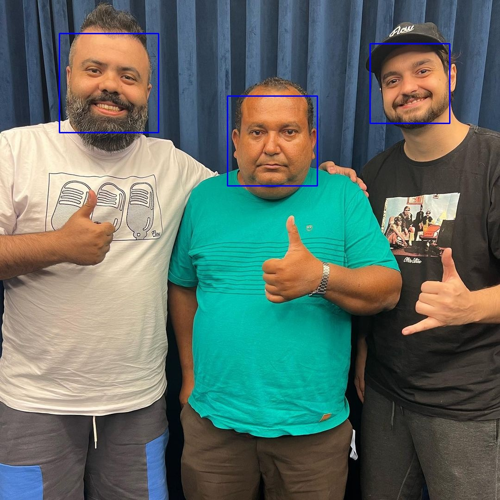
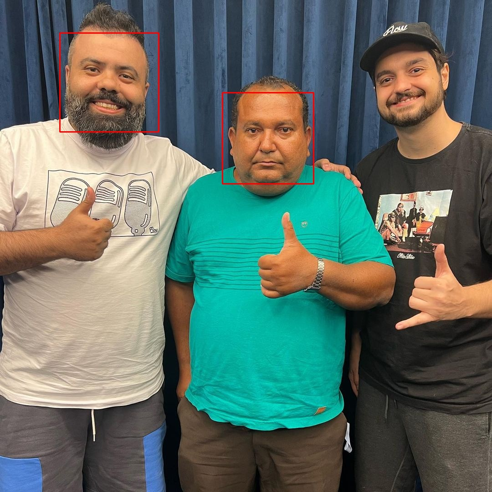
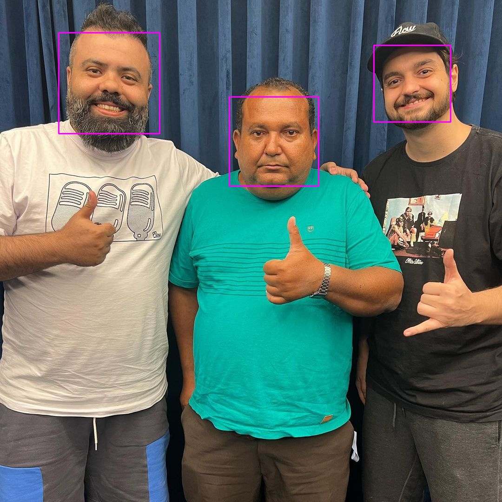
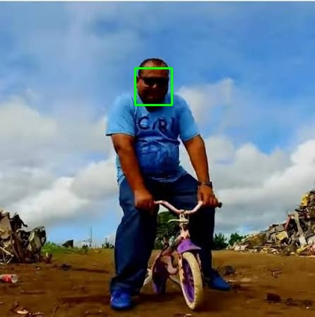
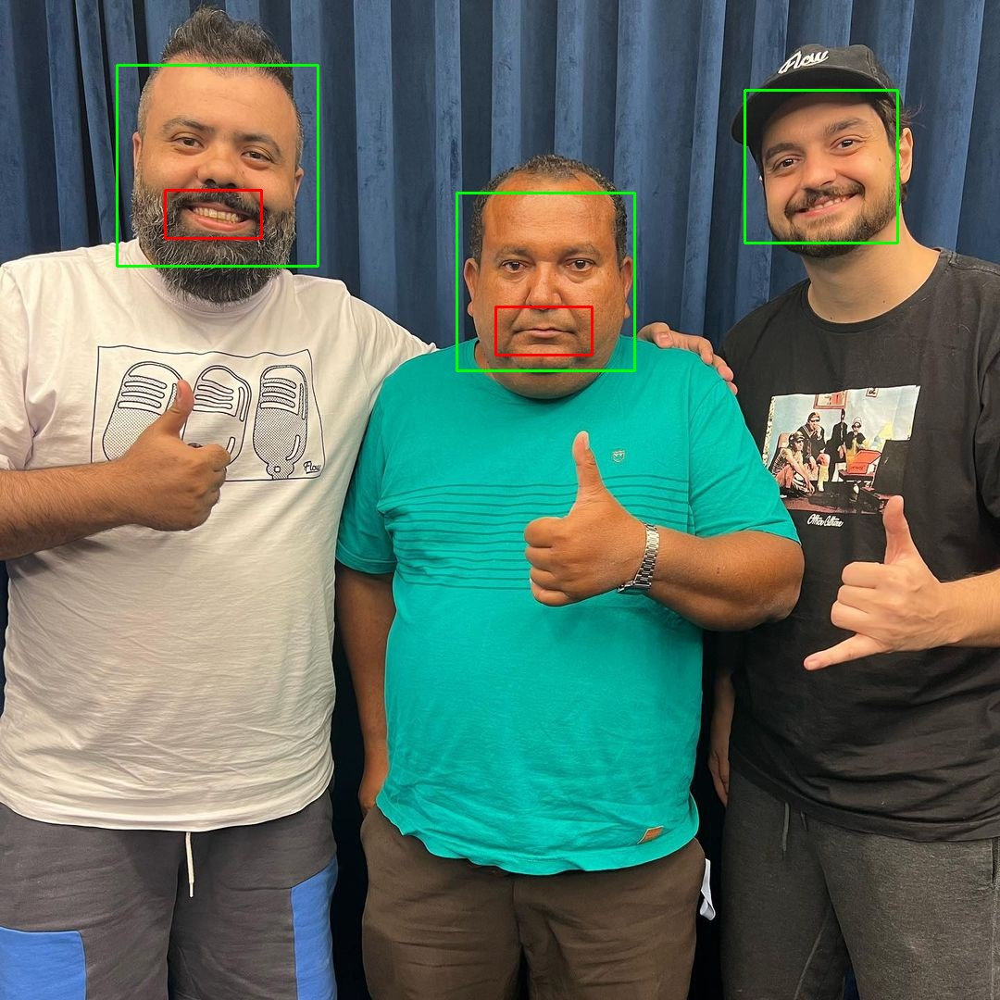

# Atividade Prática — Haar Cascade e Detecção de Faces
**Dupla:** Camila, Diego Breskovit

---

## Imagens utilizadas

Todas as imagens são do **Ednaldo Pereira**, escolhidas intencionalmente por apresentarem condições variadas: presença de óculos escuros, iluminação irregular, ângulos laterais e rostos em diferentes tamanhos.

---

## Parte 1 — Detecção de Faces

**Imagem usada:** `img002.jpg`  
**Classificador:** `haarcascade_frontalface_default.xml`  
**Resultado:** 3 faces detectadas ✓ (todas corretas)

O detector padrão com `scaleFactor=1.10` e `minNeighbors=5` identificou corretamente as 3 faces sem falsos positivos.

---

## Parte 2 — Influência dos Parâmetros

**Imagem usada:** `img002.jpg` (3 faces reais presentes)

| Experimento | Parâmetro alterado | Faces detectadas | Falsos positivos | Observação |
|---|---|:---:|:---:|---|
| Padrão | sf=1.10, mn=5 | **3** | 0 | Resultado correto |
| A | scaleFactor=1.05 | **3** | 0 | Varredura mais fina, mesmo resultado |
| B | scaleFactor=1.30 | **2** | 0 | **Perdeu 1 face** — salto grande entre escalas pulou o rosto menor |
| C | minNeighbors=3 | **4** | 1 | **1 falso positivo** — limiar mais baixo aprovou uma região espúria |
| D | minNeighbors=8 | **3** | 0 | Mais restritivo, manteve as 3 faces reais |

**Comparação:** O `scaleFactor=1.30` causou a perda de uma detecção legítima; o `minNeighbors=3` inseriu um falso positivo. O `scaleFactor=1.05` e o `minNeighbors=8` produziram resultados equivalentes ao padrão nesta imagem.

Para confirmar o efeito do `scaleFactor`, em `img003.jpg` o `scaleFactor=1.05` gerou **4 detecções** — 3 falsos positivos nos blocos do fundo — enquanto o padrão `1.10` detectou apenas a face real.

| A — scaleFactor=1.05 | B — scaleFactor=1.30 |
|:---:|:---:|
|  |  |
| 3 faces | 2 faces — **perdeu 1** |

| C — minNeighbors=3 | D — minNeighbors=8 |
|:---:|:---:|
|  |  |
| 4 faces — **1 falso positivo** | 3 faces |

---

## Parte 3 — Outros Detectores

### 3a — Detector de Olhos (`haarcascade_eye.xml`)

**Classificador:** `haarcascade_eye.xml` — detecta olhos dentro do ROI de cada face encontrada pelo detector frontal.

#### Caso com sucesso — `img002.jpg` (três pessoas, sem óculos)

| Métrica | Resultado |
|---|---|
| Faces detectadas | 3 |
| Olhos detectados dentro do ROI | 6 ✓ (2 por face) |

Três rostos frontais sem óculos em boa iluminação. O detector encontrou exatamente 2 olhos em cada ROI de face, sem nenhum falso positivo.

#### Caso com problema — `img001.jpg` (óculos escuros)

| Métrica | Resultado |
|---|---|
| Faces detectadas | 1 |
| Olhos detectados dentro do ROI | 0 ✗ |

Mesmo com a face detectada, o classificador de olhos retornou **0 detecções**. As lentes opacas eliminam o gradiente de intensidade que o algoritmo utiliza, nenhuma feature Haar ativa, e a detecção falha completamente.

### 3b — Detector de Sorriso (`haarcascade_smile.xml`)

**Imagem usada:** `img002.jpg`

| Métrica | Resultado |
|---|---|
| Faces detectadas | 3 |
| Sorrisos detectados | 2 |

Os parâmetros restritivos (`scaleFactor=1.7`, `minNeighbors=22`) foram necessários para evitar falsos positivos. Mas mesmo assim apenas 2 sorrisos foram detectados.

---

## Parte 4 — Limitações do Haar Cascade

### Caso A — Óculos escuros bloqueando a região dos olhos

**Imagem:** `img007.jpg` — Ednaldo em selfie inclinada dentro do carro, óculos escuros  
**Resultado:** **0 faces detectadas** em todos os experimentos

O Haar Cascade para faces depende fortemente de features na região dos olhos (contraste entre íris escura e região mais clara ao redor). Óculos escuros opacos destroem completamente esse gradiente. Adicionalmente, a pose levemente lateral desta foto faz a face perder a simetria que o classificador frontal espera.

### Caso B — Rosto pequeno e iluminação extrema

**Imagem:** `img004.jpg` — Ednaldo caminhando ao longe, camiseta rosa, luz intensa ao fundo  
**Resultado:** **0 faces detectadas** por todos os detectores padrão.

A face ocupa área muito pequena na imagem (abaixo de 60×60 px efetivos), a contraluz cria sombras intensas que invertem os gradientes esperados, e os óculos escuros removem as features oculares. A combinação dos três fatores levou à falha total.

---

## Parte 5 — Análise Técnica

### 1. Qual parâmetro teve maior influência: `scaleFactor` ou `minNeighbors`?

**`scaleFactor` teve maior influência.** Valores extremos causaram efeitos mais dramáticos e irreversíveis:

- `scaleFactor=1.30` em `img002` perdeu 1 face real (falha de detecção).
- `scaleFactor=1.05` em `img003` produziu 4 detecções onde havia 1 face real, e 2 faces em `img001` onde havia apenas 1.
- `minNeighbors=3` adicionou apenas 1 falso positivo em `img002`; `minNeighbors=8` manteve o resultado correto.

O `scaleFactor` controla a granularidade da pirâmide de escalas: se muito alto, janelas intermediárias são puladas e faces de certos tamanhos ficam invisíveis ao detector; se muito baixo, o custo computacional sobe e regiões texturizadas do fundo passam a ser falsamente aceitas.

### 2. Em quais situações o Haar Cascade apresentou melhor desempenho?

- **Faces frontais e grandes** no frame (`img002`, `img005`): detectou 100% das faces reais sem falsos positivos.
- **Iluminação artificial uniforme** (fundo neutro de `img002`): sem sombras fortes que distorçam os gradientes.
- **Sem óculos escuros** (`img005`): a região dos olhos ficou disponível, permitindo ao detector de olhos encontrar os 2 olhos reais.
- **Múltiplas pessoas frontais** (`img002`): o detector de sorriso discriminou corretamente quem sorria (2 faces) de quem tinha expressão neutra (Ednaldo).

### 3. Em quais situações apresentou pior desempenho?

- **Óculos escuros** (`img004`, `img007`, `img008`): principal limitação observada; o padrão retornou 0 faces nas três imagens.
- **Ângulo lateral acentuado** (`img007`): 0 faces em absolutamente todos os detectores testados, incluindo o alt2 treinado para maior robustez.
- **Rosto pequeno e distante com contraluz** (`img004`): tamanho abaixo do `minSize`, sombras invertidas e óculos.
- **Fundo altamente texturizado** com `scaleFactor` baixo (`img003`, sf=1.05): o fundo de Minecraft com padrões regulares gerou 3 falsos positivos.

### 4. Qual detector escolhido apresentou maior taxa de acerto?

O **detector de olhos** (`haarcascade_eye.xml`) em `img005` apresentou o melhor resultado: detectou os 2 olhos reais do close-up frontal sem óculos, com apenas 1 falso positivo em sombra de bochecha.

O **detector de sorriso** (`haarcascade_smile.xml`) também se saiu bem em `img002`, identificando corretamente os 2 sorrisos dos 2 indivíduos que sorriam, sem confundir a expressão neutra de Ednaldo com sorriso. Ambos dependem, contudo, de imagens frontais sem óculos nas imagens com óculos escuros, os dois retornaram 0 detecções.

### 5. Duas vantagens do Haar Cascade

1. **Velocidade em tempo real sem GPU:** graças à Imagem Integral (que calcula somas de qualquer retângulo em 4 operações) e ao classificador em cascata (que rejeita mais de 95% das janelas nos primeiros estágios), o detector roda em CPU comum em dezenas de FPS.
2. **Leveza e portabilidade:** o modelo é um arquivo XML de poucos kilobytes, já incluso no OpenCV, sem necessidade de dependências extras, frameworks de Deep Learning ou hardware especializado, é viável em Raspberry Pi e sistemas embarcados.

### 6. Duas limitações do Haar Cascade

1. **Intolerância a óculos escuros e oclusão:** como demonstrado em `img004`, `img007` e `img008`, a simples presença de óculos escuros eliminou completamente a detecção pelo classificador frontal padrão, pois as features de contraste na região dos olhos são destruídas pelas lentes opacas.
2. **Sensibilidade extrema à pose:** o detector frontal falhou totalmente em `img007`, onde o rosto estava levemente inclinado para o lado. O Haar Cascade é treinado para uma distribuição específica de poses; qualquer desvio significativo do frontal puro degrada fortemente a precisão.

### 7. Por que o algoritmo consegue executar a detecção em tempo real?

O Haar Cascade combina duas otimizações fundamentais:

**Imagem Integral:** ao pré-calcular uma imagem onde cada pixel armazena a soma acumulada de todos os pixels acima e à esquerda, é possível obter a soma de intensidades de qualquer retângulo arbitrário com exatamente 4 acessos de memória independente do tamanho da região. Isso torna o cálculo de cada feature Haar O(1).

**Cascata de classificadores (AdaBoost):** em vez de aplicar todos os ~160.000 features Haar possíveis em cada janela, o classificador está organizado em estágios progressivamente mais complexos. A maioria das janelas (regiões de fundo) é rejeitada já no 1° ou 2° estágio com apenas 2–3 comparações. Somente janelas que passam em todos os estágios são declaradas face. Isso reduz drasticamente o número médio de operações por janela, tornando viável varrer uma imagem inteira em milissegundos.

### 8. Haar Cascade ou Deep Learning para monitoramento em ambiente real?

Para um sistema de monitoramento em ambiente real, **Deep Learning (CNN)** seria a escolha mais adequada, e os experimentos realizados justificam essa conclusão diretamente:

Os resultados mostraram 0 detecções em `img004`, `img007` e `img008` — todas imagens de Ednaldo com óculos escuros em situações comuns do dia a dia (praia, carro, passeio). Em um sistema de monitoramento real, câmeras de segurança frequentemente capturam pessoas com óculos, chapéus, máscaras e em ângulos variados. Uma taxa de falha de ~37,5% das imagens (3 de 8) seria inaceitável em produção.

Modelos modernos como MTCNN, RetinaFace ou YOLOv8-face são robustos a óculos, variações de pose de até ±90°, iluminação extrema e oclusões parciais. O custo é maior dependência de hardware (GPU), mas esse tradeoff é plenamente justificado em aplicações reais de segurança.

O Haar Cascade seguiria como opção válida apenas em cenários muito controlados (torniquete com câmera frontal fixa, boa iluminação e sem acessórios) ou em dispositivos com CPU apenas e restrição severa de recursos computacionais.